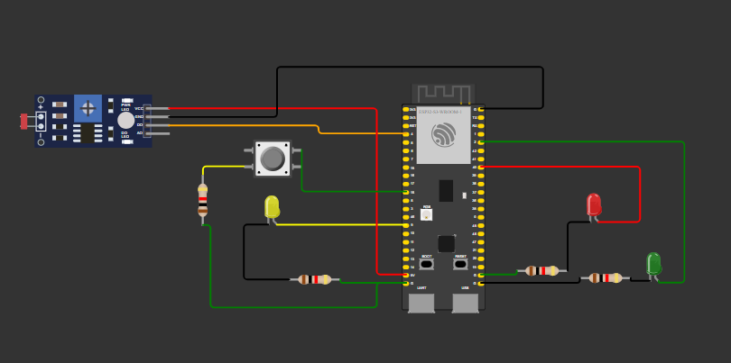

### Aluna: Karine Victoria Rosa da Paixão 
### Data: 13/12/2024

&nbsp;&nbsp;&nbsp;&nbsp;A presente atividade foi feita pela ferramenta wokwi, o desafio foi a criação de um semáforo inteligente que fosse capaz de detectar se estava de dia ou de noite. Caso fosse detectado que era de dia, devia haver uma alternância entre as cores verde (3 segundos), amarelo (2 segundos) e vermelho (5 segundos).

&nbsp;&nbsp;&nbsp;&nbsp;Caso fosse detectado que era de noite, devia apresentar o piscar do led de cor amarela a cada 1 segundo.

&nbsp;&nbsp;&nbsp;&nbsp;Abaixo deixo uma representação de como ficou o modelo criado no wokwi: 

Figura 2 - Imagem do semáforo

Fonte: Material produzido pela autora (2024)

